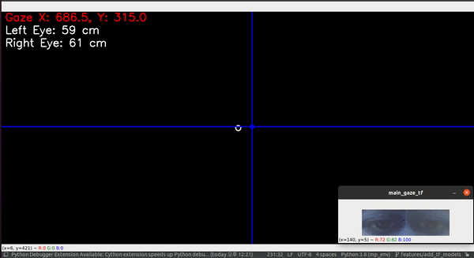
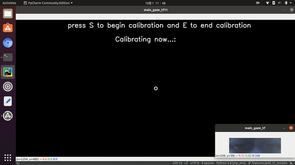
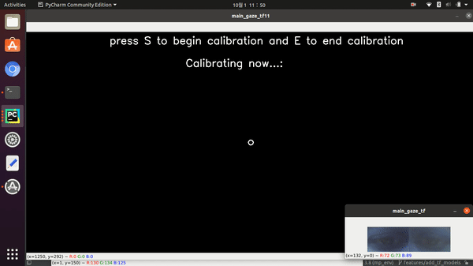
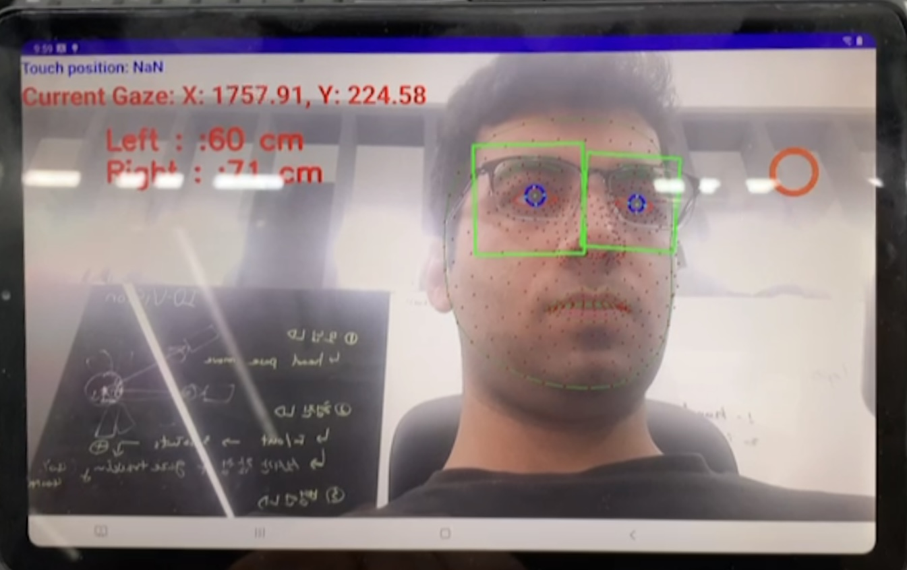

# EyeGaze
[[Home]](http://monibsediqi.github.io)

Contact: Monib Sediqi (kh.monib@gmail.com)

## Overview
A desktop and mobile gaze app that accurately estimates user's gaze on screen using the available webcam of computer or mobile. 

## Desktop App Demo

         

"***"

## Non-smoothed Gaze VS Smoothed Gaze
### Non-smoothed Gaze

         

"***"

### Smoothed Gaze

         

"***"

## Mobile App Demo

## Head Pose Normalization
### Rotation Normalization

         

"***"

### Scale Normalization

         

"***"

### Translation Normalization
### Scale Normalization

         
